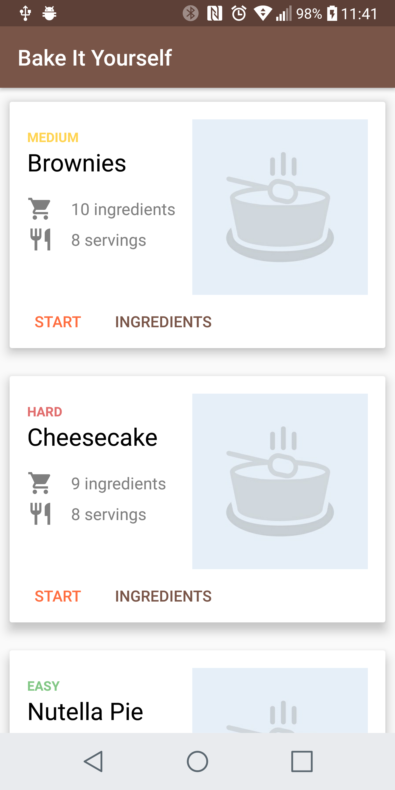
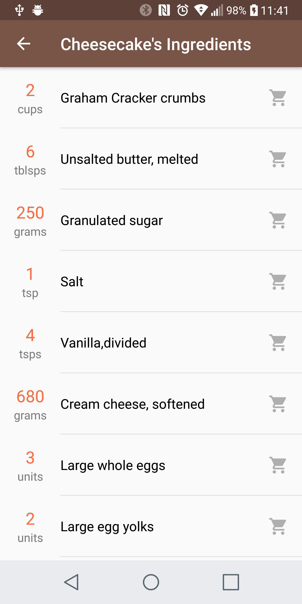
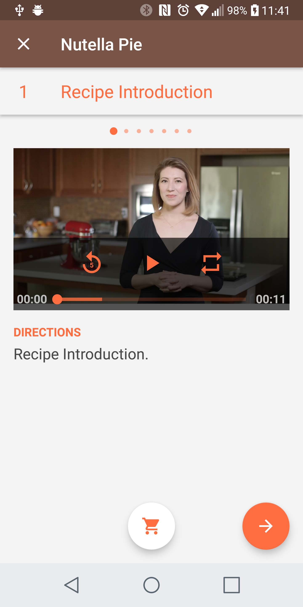
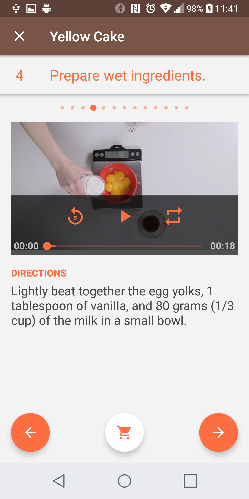
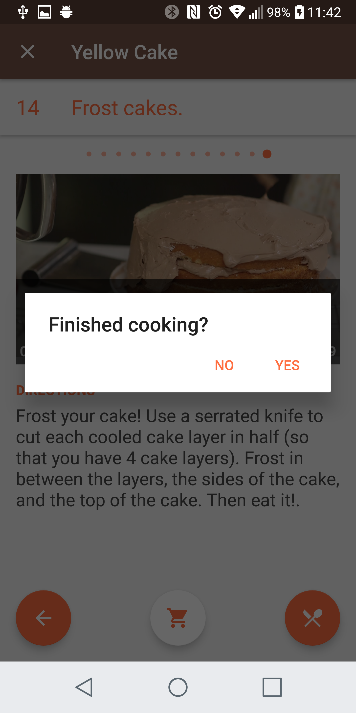

# BIY (Bake It Yourself)
This project is from the Udacity Nanodegree - Advanced Android Development course (Project 3).

[Course Link](https://br.udacity.com/course/android-developer-nanodegree--nd801)

## Screenshots from the final app

## JSON Parsing
The project uses an external JSON file for parsing.

[File Link](https://d17h27t6h515a5.cloudfront.net/topher/2017/May/59121517_baking/baking.json)
